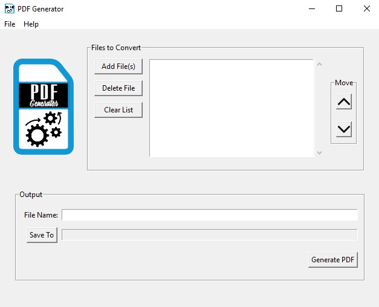

# PDF Generator
A simple Python application that allows the user to merge multiple compatible file types into a single PDF.



Current compatible file types include:
* .docx (requires Microsoft Word to be installed)
* .pdf
* .txt
* .gif
* .jpg
* .jpeg
* .png
<br/>
<br/>
## Installation
* Download the repository as ZIP or clone the repository to the preferred location on your computer: 
```sh
git clone https://github.com/N8Brown/readme-template.git
```
* Open a terminal and navigate to the project directory
* Create a virtual environment within the project directory:
```sh
python -m venv env
``` 
* Activate the virtual environment:
    * Windows
    ```sh
    . env/Scripts/activate
    ```
    * OS X / Linux
    ```sh
    source env/bin/activate
    ```
* Install requirements
```sh
pip install -r requirements.txt
```
* Run program
```sh
python pdf_generator.py
```

### Windows:
The dist folder contains a standalone executable file for the most recent version of the program. This may be run without the need to follow the steps above.
    *NOTE: The program files can be moved to the desired location but assets folder must remain in the same directory as the .exe file


### OS X / Linux:
To create an executable file:
* Open your terminal and navigate to the project directory
* Activate the virtual environment from within the project directory
* Run Pyinstaller
```sh
pyinstaller --onefile --windowed --icon=assets/logo.ico pdf_generator.py
```

* NOTE: Refer to [Pyinstaller documentation](https://www.pyinstaller.org/documentation.html) for operating system specific information
<br/>
<br/>
## Release History
* 1.2.0
    * CHANGE: Update ``convert_to_pdf()`` to include support for handling .docx files
* 1.1.1
    * ADD: Add menu bar with File and Help menus
        * File Menu:
            * Add File(s) - Calls ``add_files()`` similar to Add File(s) button
            * Exit - kills the program and closes the window
        * Help Menu: 
            * About - Calls ``about()`` which displays an alert window with the program version information
* 1.1.0
    * CHANGE: Update ``convert_to_pdf()`` to include support for handling .txt and .pdf files
* 1.0.0
    * Initial release
<br/>
<br/>
## Meta
[Nathan Brown](https://www.nathanabrown.com) - [@_N8_Brown](https://twitter.com/_N8_Brown) - contact@nathanabrown.com 

[https://github.com/N8Brown/pdf_generator](https://github.com/N8Brown/pdf_generator)

Distributed under the GPL-3.0 License. See ``LICENSE`` for more information.

