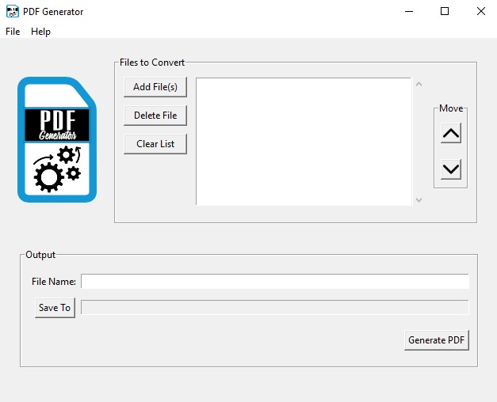

# PDF Generator v1.2.0
A simple Python application that allows the user to merge multiple compatible file types into a single PDF.

## Technologies
This project was created using Python 3.9.2 and utilizes the following packages:
* Pillow 8.2.0
* PyPDF 1.26.0
* FPDF 1.7.2
* docx2pdf 0.1.7

## Release History
* 1.1.1
    * ADD: Add menu bar with File and Help menus
        * File Menu:
            * Add File(s) - calls ``add_files()`` similar to Add File(s) button
            * Exit - kills the program and closes the window
        * Help Menu: 
            * About - Displays an alert window with the program version information
* 1.1.0
    * ADD: Add ``text_to_pdf()``
    * ADD: Add ``elif file_type == 'pdf':`` statement to ``convert_to_pdf()`` to include .pdf file support
    * CHANGE: Update ``convert_to_pdf()`` to include ``text_to_pdf()`` for .txt file support.
* 1.0.0
    * Initial release

## Meta
Nathan Brown - @_N8_Brown - contact@nathanabrown.com

Distributed under the GPL-3.0 License. See ``LICENSE`` for more information.

[https://github.com/N8Brown/pdf_generator](https://github.com/N8Brown/pdf_generator)

